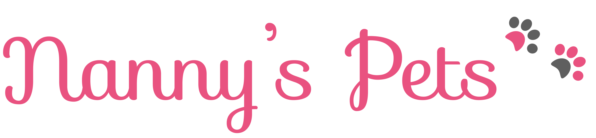

# Nanny's Pets

O projeto Nanny's Pets tem como objetivo desenvolver um sistema para o serviço de hospedagem de cachorros e gatos pela necessidade de eventual compromisso dos seus donos, deixando assim seu(s) pet(s) nas casas de hospedeiros que sejam capacitados para realizar o serviço.  

 

**Observações importantes:** O início do projeto surgiu na disciplina de Projeto de Desenvolvimento de Sistema Web, e foi sendo desenvolvido e aprimorado ao longo das disciplinas de Projeto de Desenvolvimento de Sistema Distribuído e Projeto de Desenvolvimento de Sistema Coorporativo até termos o projeto em sua [versão 2.0.](https://github.com/anna-albuquerque/mynannyspets/releases/tag/EngenhariaDeRequisitos)
 
A partir daí, as alterações no projeto feitas neste repositório foram feitas pelo membro da equipe: Anna Carolinne.

# Equipe e Formas de Contato
Versão 2.1 
1. Anna Carolinne - [GitHub](https://github.com/anna-albuquerque)  

Versão 2.0 - [Repositório Oficial](https://github.com/tads-cnat/nannys-pet)
1. Anna Carolinne - [GitHub](https://github.com/anna-albuquerque) 
2. Joana Fernandes - [Github](https://github.com/JoanaFernandes1998)
3. Renato Bernardino - [GitHub](https://github.com/renatobernardinodasilva)
4. Virgínia Cláudia - [GitHub](https://github.com/VCLM)
5. Wemerson Chagas - [Github](https://github.com/wemersonchaga)

**Orientador:** Plácido Neto - [GitHub](https://github.com/placidoneto)

 

# Ferramentas e tecnologias utilizadas no desenvolvimento do projeto:

* Github para a realizar o controle de versões do projeto.
* Figma para a prototipação em baixa, média e alta fidelidade da interface do sistema;
* ERDPlus para elaboração dos diagramas ER;
* Html 5 como linguagem de marcação;
* CSS 3 para estilizar as páginas web;
* Python + Django Rest Framework;
* Angular para o frontend;
* SQLite para o banco de daddos;
* Docker, Dockerfile, Docker Compose, Docker Hub, utilizados para a criação de imagens com um arquivo de instruções para construção de contêineres, com multiplos contêineres e para a publicação das imagens;
* Azure para implantar o sistema na nuvem.
 

# Documentação

* [Documento de visão](doc/DocumentoDeVisao/doc-visao.md)
* [Diagrama Entidade-Relacionamento](doc/DiagramaER/DiagramaER.md)
* [Diagrama de Classe de Domínio](doc/DiagramaDeClassesDeDominio/dominio.md)
* [Diagrama de Contexto](doc/DiagramaDeContexto/Diagrama-Contexto.md)
* [Diagrama de Container](doc/DiagramaDeContainer.md/DiagramaDeContainer.md)
* [Modelo de casos de uso](doc/CDUs/cdu.md)
* [Visão Arquitetural](doc/VisaoArquitetural/VisaoArquitetural.md)
* [Diagrama de Sequência](doc/DiagramaDeSequencia/DiadramaDeSequencia.md)
* [Diagrama de Interação](doc/DiagramaDeInteracao/DiagramaDeInteracao.md)
* [Dicionário de Dados](doc/DicionarioDeDados/DicionarioDeDados.md)
* [Protótipos de interface com o usuário](doc/prototipos/prototipos.md)
* [Guia do desenvolvedor](guia-receber-pets.md)